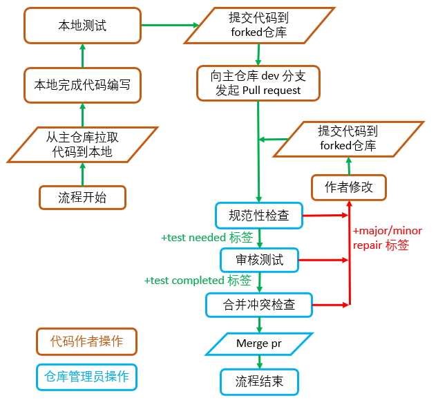
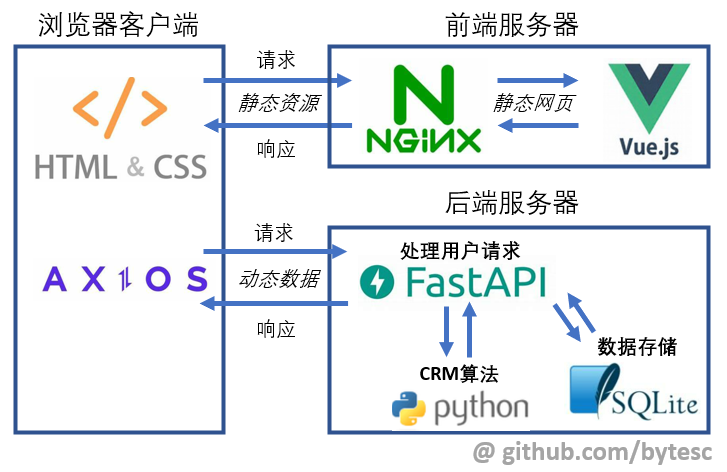

# simple-crm-system
simple-crm-system

## 代码工作流程



## 项目架构



## 项目结构

```txt
│  LICENSE
│  README.md
│
└─database
    │  select-food-info.sql
    │  README.md
    │
    └─db-source
            main.sql
            crm.sqlite3

```


### 数据库相关 `./database`

- `./database/` 目录存放可能用到的 sql 语句文件。
- `./database/README.md` 为数据库和 sql 脚本说明。
- `./database/db-source/` 存放数据库文件和备份 sql 文件。


